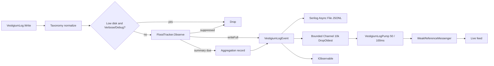

# Vestigium.Logging — Design Document

**Version:** 1.1  
**Date:** 17 September 2026  
**Companion:** Requirements Specification v1.3 (P0 updates in §3.4–3.5)

## 1. Intent

This library is the single logging façade for the Vestigium WPF suite. Hosts call `VestigiumLogger.Initialize` once. Diagnostic threads call `VestigiumLog.*` and return immediately. Disk, flood aggregation, and UI subscribers are isolated from each other so a stalled dispatcher or a full disk cannot stall ICMP / HTTP probes.

## 2. Projects

```
Vestigium.Logging.slnx
├── src/Vestigium.Logging          net10.0 class library (no WPF reference)
├── src/Vestigium.Logging.Tests    xUnit
└── src/Vestigium.Logging.Demo     net10.0-windows WPF MVVM gallery
```

The engine targets `net10.0` so tests run without a STA dispatcher. The demo is the only WPF project. Lifetime is bound with reflection/`Exit` so the library stays UI-framework agnostic.

## 3. Runtime shape



## 4. Types

| Type | Role |
|---|---|
| `VestigiumLogLevel` / `VestigiumStatus` | Compile-time enums |
| `VestigiumLogEvent` | Immutable record delivered to disk and subscribers |
| `VestigiumLoggerOptions` | Builder surface; defaults match SRS v1.3 |
| `VestigiumTaxonomy` | Category catalog + normalize |
| `FloodIdentity` | Value record (AppId, Category, Level, Message) |
| `FloodTracker` | Per-key windowed counter |
| `DiskSpaceMonitor` | 30 s `DriveInfo` poll + demo override |
| `VestigiumJsonFormatter` | Canonical JSON Lines |
| `VestigiumLogger` | Process singleton host |
| `VestigiumLog` | Call-site API |
| `VestigiumUninitializedBehavior` | Throw (default) or NoOp writes before Initialize |

## 5. Flood algorithm

Copied from the accepted Gemini follow-up:

1. Identity is a record, never `"A|B|C|D"`.
2. First `FloodThresholdCount` (5) observations in the window emit full lines.
3. Further observations increment `Suppressed` and return `writeFull = false`.
4. A 1-second timer calls `DrainExpired`. If the window elapsed and `Suppressed > 0`, emit `[Aggregated] Previous message repeated X additional times` with `STATUS=None`, the original LEVEL / APPID / CATEGORY, and the last observed SUBCATEGORY. Expired keys are **removed** from the map.
5. `Observe` after expiry with pending suppressed also flushes then starts a new window with count 1.
6. Distinct identities are capped (`FloodIdentityCap`, default 4096). Overflow drops expired, then oldest idle, then flushes-and-drops oldest pending suppressed.

PingIQ and TraceIQ with the same MESSAGE are different keys because APPID differs.

## 6. Serilog mapping

| Vestigium LEVEL | `LogEventLevel` |
|---|---|
| Verbose | Verbose |
| Debug | Debug |
| Information | Information |
| Warning | Warning |
| Error | Error |
| Fatal | Fatal |

The file sink uses a custom `ITextFormatter` that writes the pre-serialized JSON already attached as `VestigiumJson`. Serilog is not allowed to invent extra property names on disk — PowerBI maps stay stable.

Rolling: daily interval **and** 20 MB size, retain 90 files and 14 days, `shared: true`, UTF-8 no BOM.

`MinimumDiskLevel` (default Information) filters the file sink only. Verbose/Debug still reach subscribers unless the disk tripwire is active.

## 7. WPF demo (MVVM)

- `App.OnStartup` initializes the logger and `BindLifetime(Current)`.
- `MainViewModel : ObservableRecipient` owns configuration, composer, and counters.
- A background `PumpAsync` calls `VestigiumLogPump.RunAsync` and `WeakReferenceMessenger.Default.Send(new LogBatchMessage …)`.
- The ViewModel handler marshals onto `Application.Current.Dispatcher` once per batch and prepends `LogRow` items (cap 400).
- Gallery tabs are `DataTemplate` resources (same pattern as `Vestigium.Converters.Demo`).

Configuration Apply tears down the host and calls `Initialize` again so sliders are live.

## 8. Disk tripwire

`DriveInfo` on the volume that holds `LogDirectory`. Trip = free < 10% of total **or** (if `DiskBytesFloorEnabled`) free < 5 GB. `VestigiumLogger.DiskStatus` is the snapshot. Demo checkbox calls `VestigiumLogger.OverrideDiskPressure(true)` so the gallery can show the throttle without filling a disk.

## 9. Failure policy

- Subscriber `OnNext` exceptions are swallowed.
- Disk poll exceptions are swallowed.
- Channel full → DropOldest.
- Serilog async full → drop (`blockWhenFull: false`).
- Convert/log never throws on the calling diagnostic thread except the initialize guard.
- `Flush` wait timeout returns without throwing; writes stay accepted.
- ProcessExit / Ctrl+C / WPF `Exit` call `Shutdown`, not `Flush`.

## 10. Test plan

| Test | Asserts |
|---|---|
| `FloodTrackerTests.FirstFiveAreWritten_ThenSuppressed` | 22 events → 5 full, 17 suppressed |
| `DifferentAppIdsDoNotShareCounters` | Ping vs Trace |
| `WindowExpiryFlushesAggregationCount` | DrainExpired returns 3 after 8 writes at threshold 5 |
| `ExpiredKeysAreRemoved` | Tracked count 0 after window |
| `CapEvictsOldestIdle` | Distinct keys over cap |
| `PendingSuppressedFlushedBeforeEvict` | Summary enqueued before drop |
| `JsonPreservesMultilineAndPipes` | One JSON object, MESSAGE intact |
| `UnregisteredCategoryFallsBack` | Widgets → Uncategorized |
| `InitializeRequiredBeforeWrite` | InvalidOperationException |
| `FloodBurstWritesFivePlusAggregation` | Host integration |
| `FlushDoesNotStopWrites` | Write after Flush |
| `ShutdownStopsWrites` | Write throws after Shutdown |
| `BindLifetimeExitShutsDown` | Dummy `Exit` event |
