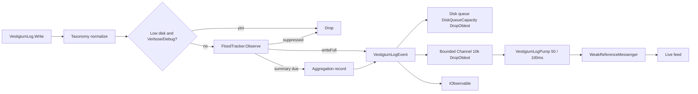

# Vestigium.Logging — Design Document

**Version:** 1.3  
**Date:** 17 September 2026  
**Companion:** Requirements Specification v1.10, package 1.2.0

## 1. Intent

This library is the single logging façade for the Vestigium WPF suite. Hosts call `VestigiumLogger.Initialize` once. Diagnostic threads call `VestigiumLog.*` and return immediately. Disk, flood aggregation, and UI subscribers are isolated from each other so a stalled dispatcher or a full disk cannot stall ICMP / HTTP probes.

## 2. Projects

```
Vestigium.Logging.slnx
├── src/Vestigium.Logging          net10.0 class library (no WPF reference)
├── src/Vestigium.Logging.Tests    xUnit
└── src/Vestigium.Logging.Demo     net10.0-windows WPF MVVM gallery
```

The engine targets `net10.0` so tests run without a STA dispatcher. The demo is the only WPF project. Lifetime is bound with reflection/`Exit` so the library stays UI-framework agnostic.

## 3. Runtime shape



## 4. Types

| Type | Role |
|---|---|
| `VestigiumLogLevel` / `VestigiumStatus` | Compile-time enums |
| `VestigiumLogEvent` | Immutable record delivered to disk and subscribers |
| `VestigiumLoggerOptions` | Builder surface; defaults match SRS v1.3 |
| `VestigiumTaxonomy` | Category catalog + normalize |
| `FloodIdentity` | Value record (AppId, Category, Level, Message) |
| `FloodTracker` | Per-key windowed counter |
| `DiskSpaceMonitor` | 30 s `DriveInfo` poll + demo override |
| `VestigiumJsonFormatter` | Canonical JSON Lines |
| `IVestigiumJsonlWriter` / `VestigiumJsonlWriter` | Owned disk backend |
| `VestigiumLogger` | Process singleton host |
| `VestigiumLog` | Call-site API |
| `VestigiumUninitializedBehavior` | Throw (default) or NoOp writes before Initialize |
| `VestigiumExceptionDetail` | Full / TypeAndMessage / None |

## 5. Flood algorithm

1. Identity is a record, never `"A|B|C|D"`.
2. First `FloodThresholdCount` (5) observations in the window emit full lines.
3. Further observations increment `Suppressed` and return `writeFull = false`.
4. A 1-second timer calls `DrainExpired`. If the window elapsed and `Suppressed > 0`, emit `[Aggregated] Previous message repeated X additional times` with `STATUS=None`.
5. Distinct identities are capped (`FloodIdentityCap`, default 4096).

## 6. Disk backend

The line on disk is `VestigiumJsonFormatter.Serialize` / `ToJsonLine()`. No sink invents extra JSON names.

**1.2.0 (`VestigiumJsonlWriter`):** `SerilogAsyncBuffer` is an obsolete alias of `DiskQueueCapacity`.

| Call | Behavior |
|---|---|
| `Enqueue` | never blocks; DropOldest when full |
| `Flush(timeout)` | wait until queued lines are on disk |
| `Complete` | stop accepting, drain, close handle |

File: UTF-8 no BOM, `FileShare.Read`, path `vestigium-{APPID}-yyyyMMdd.json`. Roll on UTC date or 20 MB; same-day size roll uses `-n`. Retention: 14 days and 90 files.

## 7. Failure policy

- Subscriber `OnNext` exceptions are swallowed.
- Disk queue full → DropOldest (`DiskQueueCapacity`).
- `Flush` timeout returns without throwing; writes stay accepted.
- ProcessExit / Ctrl+C / WPF `Exit` call `Shutdown`, not `Flush`.
